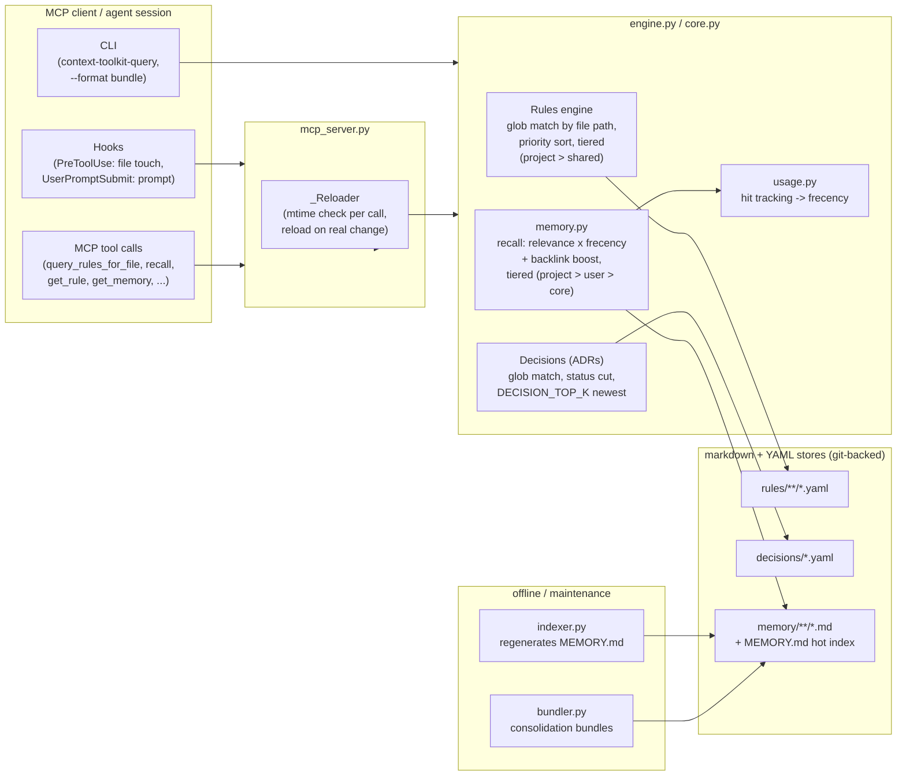

# Architecture

How a query flows from an MCP client (or hook) through the engine to the
markdown stores on disk.

## Design points

- **Stateless per call.** Every query reads from the in-memory model; the
  `_Reloader` re-loads from disk only when the store's max mtime actually
  changed — no file-watcher daemon, safe under concurrent sessions.
- **Tiers, not merges.** Multiple roots (project / shared / user / core) stay
  separate; on a key collision the more specific tier wins. Rules fall back to
  the shared "discipline floor" only when a file matches zero project rules.
- **The store is the API.** Plain markdown/YAML in git — editable by humans,
  agents, and consolidation passes alike. The engine never writes to the store;
  writers are the operator and offline tools (`indexer.py`, `bundler.py`).
- **Frecency, not recency.** `usage.py` records hits per memory; recall ranks
  by keyword relevance weighted with frequency + recency, so long-lived,
  often-used knowledge stays hot without manual pinning. On top, the MCP
  `recall` tool adds a log-dampened **backlink boost** (`log1p(inbound) * 0.1`)
  from the `[[link]]` graph, so structurally central memories rise without
  explicit usage.
